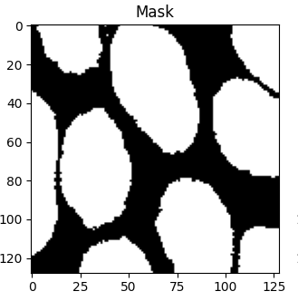
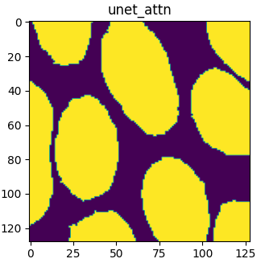
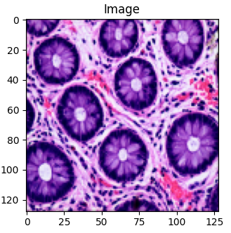
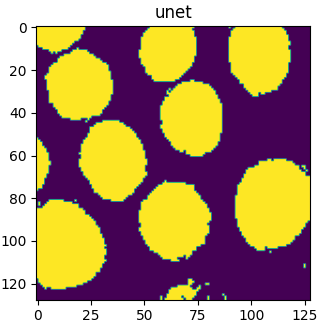
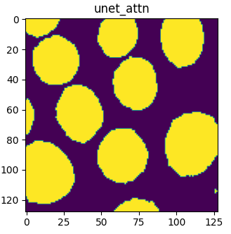
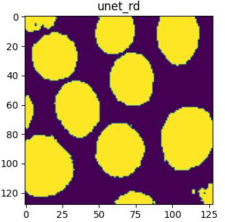

# PyUNET

Python based tool for UNet and Variants

<p align="center">
  
  
  
  
  
</p>

<p align="center">
  
  
  
  
  
</p>

## Installation and Setup

1. Install dependencies

For `pip` users use:

```
pip install -r requirements.txt
```

2. Activate the environment

For `venv` users:

```
source env/bin/activate
```

## Modes

Values passed in the `--mode [mode]` flag

### Training a UNet model (and variants) `train` Creates a UNet model based on the following implementations:

* `unet`: UNet (original UNet) [https://arxiv.org/abs/1505.04597](https://arxiv.org/abs/1505.04597)
* `unet_attn`: Attention UNet [https://arxiv.org/abs/1804.03999](https://arxiv.org/abs/1804.03999)
* `unet_attn_dp`: Attention UNet using Depthwise Seperable Convolutions
* `unet_attn_ghost`: Attention UNet using Ghost Convolutions
* `unet_attn_inverted_residual_block`: Attention UNet using Inverted Residual Blocks
* `unet_attn_stacked_ghost_irb`: Attenion UNet using combination of Ghost and Inverted Residual Blocks

Loss type (loss function) can be defined as follows:

* `CE`: Cross Entropy
* `DL`: Dice Loss
* `TL`: Tversky Loss
* `FL`: Focal Loss
* `DP`: Depth Loss

Sample training script:

```
python -m pyunet \
  --mode train \
  --device $DEVICE \
  --gpu-index $GPU_INDEX \
  --img-width $IMG_WIDTH \
  --img-height $IMG_HEIGHT \
  --input-img-dir $INPUT_IMG_DIR \
  --input-mask-dir $MASKED_IMG_DIR \
  --model-file $MODEL_FILE \
  --epochs $EPOCHS \
  --batch-size $BATCH_SIZE \
  --learning-rate $LEARNING_RATE \
  --in-channels $IN_CHANNELS \
  --out-channels $OUT_CHANNELS \
  --model-type $MODEL_TYPE \
  --loss-type $LOSS_TYPE \
  --cont $CONT
```

This mode also supports passing a config file via option `--config-file` for training parameters. Sample training file:

```
{
  "img_width": 128,
  "img_height": 128,
  "batch_size": 2,
  "epochs": 100,
  "learning_rate": 0.0001,
  "in_channels": 3,
  "out_channels": 2,
  "loss_type": "CE",
  "model_type": "unet",
  "device": "cuda",
  "gpu_index": 0,
  "cont": false,
  "input_img_dir": "tmp/train/images",
  "input_mask_dir": "tmp/train/masks",
  "model_file": "tmp/unet.pth"
}
```

### Sample Pair `sample-pair`

Displays the result of a given model by showing the original, mask and prediction of a an image. 

**This mode only accepts `config-file` as an option since it's possible to use multiple models at the same time.***

Sample structure of config file:

```
{
  "img_width": 128,
  "img_height": 128,
  "input_img_dir": "tmp/train/images",
  "input_mask_dir": "tmp/train/masks",
  "device": "cuda",
  "gpu_index": 0,
  "sampled_index": -1,
  "in_channels": 3,
  "out_channels": 2,
  "models": [
    {
      "type": "unet",
      "file": "tmp/unet.pth"
    },
    {
      "type": "unet_attn",
      "file": "tmp/unet_attn.pth"
    },
    {
      "type": "unet_attn_ghost",
      "file": "tmp/unet_attn_ghost.pth"
    }
  ]
}
```

### Benchmarka Model `benchmark`

Given an already trained model and test set, compute its performance in terms of F1, sensitivity, specificity, accuracy, dice_loss, etc...

Important Flags:

* `input-img-dir`: Directory containing original images for testing
* `input-mask-dir`: Ground truth for test images

Sample invocation:

```
python -m pyunet --mode benchmark \
  --img-width $IMG_WIDTH \
  --img-height $IMG_HEIGHT \
  --device $DEVICE \
  --gpu-index $GPU_INDEX \
  --input-img-dir $INPUT_IMG_DIR \
  --input-mask-dir $INPUT_MASK_DIR \
  --model-type $MODEL_TYPE \
  --model-file $MODEL_FILE \
  --in-channels $IN_CHANNELS \
  --out-channels $OUT_CHANNELS
```

### Generate Tiff

Generates a set of tiff images from masked values. Need to supply the unique grayscale values first since the program will convert the original masked colored image (presumed to be png) to grayscale then match it with the `--unique_values` flag.

```
python -m pyunet --mode generate-tiff --unique-values 62 113 137 155 176 194 --input-img-dir ./masks --output-img-dir ./output
```

### Monitor from Camera

Runs pyunet from camera feed.

```
python -m  pyunet --mode monitor --img-height 256 --img-width 256 --display-width 800 --display-height 640 --video 0 --model-file ./model.pth --model-type unet_attn_dp
```

### RGB 2 Mask Converter

Translates an RGB image to its mask version for training.

```
python -m pyunet --mode rgb2mask --config-file samples/bhuvan_satellite_dataset.json --image-file samples/bhuvan_satellite_image.png
```

## Semantic Segmentation Datasets

* [Bhuvan Satellite Image Dataset](https://www.kaggle.com/datasets/khushiipatni/satellite-image-and-mask)

## Google Colab Notebooks

* [Train](https://colab.research.google.com/drive/19t9eVCg_YViUHEYw_BRs4pzq8rVQoME5#scrollTo=vVMxfwktc4Rw)
